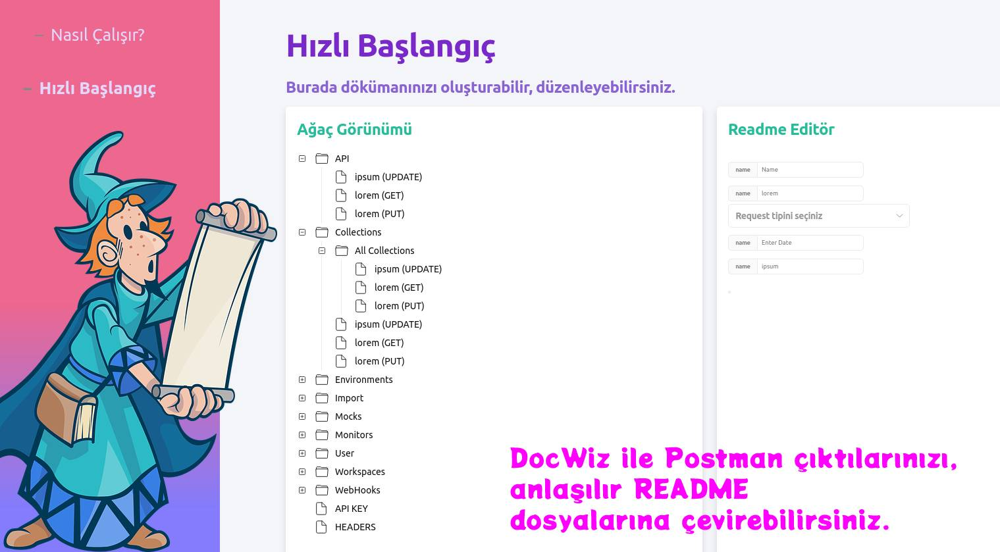

<div id="top"></div>


<!-- PROJECT LOGO -->
<br />
<div align="center">
  <a href="https://github.com/othneildrew/Best-README-Template">
    
  </a>

  <h3 align="center">Docwiz aka Documentation Wizard</h3>

  <p align="center">
    Docwiz ile rest apilerinizin postman output dosyalarını, readme dosyalarına çevirebilirsiniz.
    <br />
  </p>
</div>


<!-- TABLE OF CONTENTS -->
<details>
  <summary>Table of Contents</summary>
  <ol>
    <li>
      <a href="#about-the-project">About The Project</a>
      <ul>
        <li><a href="#built-with">Built With</a></li>
      </ul>
    </li>
    <li>
      <a href="#getting-started">Getting Started</a>
      <ul>
        <li><a href="#prerequisites">Prerequisites</a></li>
        <li><a href="#installation">Installation</a></li>
      </ul>
    </li>
    <li><a href="#usage">Usage</a></li>
    <li><a href="#roadmap">Roadmap</a></li>
    <li><a href="#contributing">Contributing</a></li>
    <li><a href="#license">License</a></li>
    <li><a href="#contact">Contact</a></li>
    <li><a href="#acknowledgments">Acknowledgments</a></li>
  </ol>
</details>


<!-- ABOUT THE PROJECT -->
## About The Project




### Built With


* [React](https://reactjs.org/)
* [Geist](https://react.geist-ui.dev/)


<!-- GETTING STARTED -->
## Getting Started

    Proje Client dosyasında, tamamlanmadı fakat npm install ve npm start ile çalıştırabilirsiniz.


### Installation

1. Clone the repo
   ```sh
   git clone https://github.com/muratdemirci/docwiz/tree/main/client
   ```
2. Install NPM packages
   ```sh
   npm install
   ```
3. Enter your API in `config.js`
   ```sh
   npm start
   ```


<!-- ROADMAP -->
## Roadmap

Version 1.0
- [x] Postman json output dosyasını ekrana yazdır
    - [x] Api dökümantasyonları nasıl olur, araştır
    - [ ] Bir şema belirle, buna göre db'ye kaydedilsin
    - [ ] api endpointlerinin klasörlenmesi (düşüneyim bunu)

- [ ] Rest apiye başla
    - [ ] Dosya upload edecek (belki?)
    - [ ] Gelen dosya output unu insert endpointi üzerinden veritabanına yazdır
    - [ ] Endpointler için description alanı

- [ ] README dosyalarının oluşturulması
    - [ ] dosya otomatik oluşturulur
    - [ ] önizlenir
    - [ ] düzenlenir
    - [ ] download edilir

yukarıdakilere vakit kalmadığı için olayı UI'da halletmeyi denedim :)

<p align="right">(<a href="#top">back to top</a>)</p>


<!-- CONTRIBUTING -->
## Contributing

Burası güncellenecek

<p align="right">(<a href="#top">back to top</a>)</p>


<!-- LICENSE -->
## License

Distributed under the Apache License Version 2.0. See `LICENSE.txt` for more information.

<p align="right">(<a href="#top">back to top</a>)</p>


<!-- CONTACT -->
## Contact

Murat demirci- [@deusmur](https://twitter.com/deusmur) - deusmur@protonmail.com

Project Link: [https://github.com/muratdemirci/docwiz](https://github.com/muratdemirci/docwiz)

<p align="right">(<a href="#top">back to top</a>)</p>
