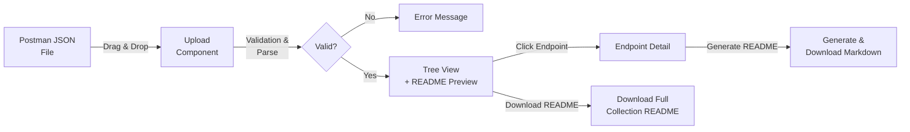
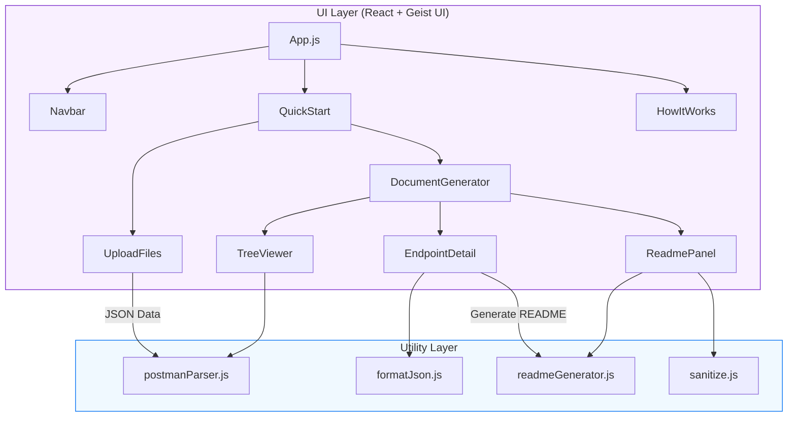
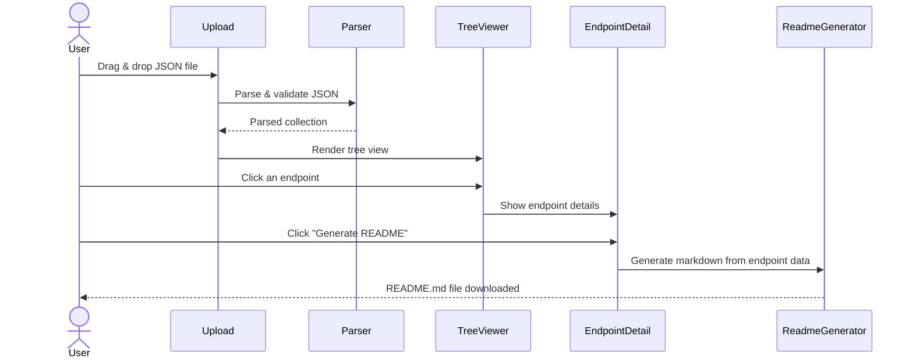
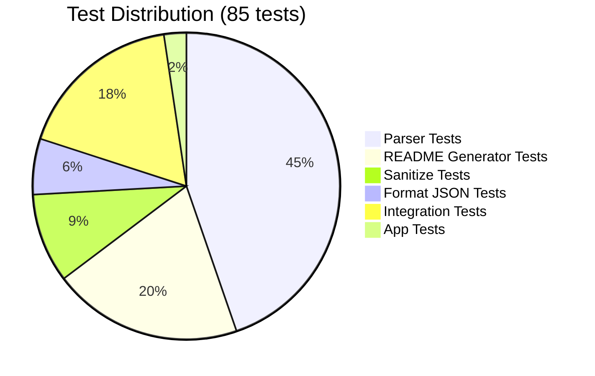

<div id="top"></div>

<br />
<div align="center">
  <a href="https://github.com/muratdemirci/docwiz">
    
  </a>

  <h3 align="center">DocWiz — Documentation Wizard</h3>

  <p align="center">
    Import Postman collection JSON files, browse endpoints, and generate a README with a single click.
    <br />
    <strong>Frontend-only</strong> — no backend required, everything runs in the browser.
  </p>
</div>

---

## Table of Contents

- [About](#about)
- [Application Flow](#application-flow)
- [Architecture](#architecture)
- [Technologies](#technologies)
- [Getting Started](#getting-started)
- [Usage](#usage)
- [Project Structure](#project-structure)
- [Testing](#testing)
- [Roadmap](#roadmap)
- [Contributing](#contributing)
- [License](#license)
- [Contact](#contact)

---

## About


DocWiz takes your **Postman v2.1 collection export** files and:

- Displays endpoints in a tree view
- Shows full details of the selected endpoint (method, URL, headers, query params, body, responses)
- Generates and downloads a **Markdown README** for that endpoint with a single click
- Offers README preview and download for the entire collection

No backend or API calls required — runs **entirely in the browser**.

---

## Application Flow


```mermaid
flowchart LR
    A[Postman JSON\nFile] -->|Drag & Drop| B[Upload\nComponent]
    B -->|Validation &\nParse| C{Valid?}
    C -->|No| D[Error Message]
    C -->|Yes| E[Tree View\n+ README Preview]
    E -->|Click Endpoint| F[Endpoint Detail]
    F -->|Generate README| G[Generate &\nDownload Markdown]
    E -->|Download README| H[Download Full\nCollection README]
```

---

## Architecture


```mermaid
graph TD
    subgraph UI["UI Layer (React + Geist UI)"]
        App[App.js]
        Nav[Navbar]
        QS[QuickStart]
        HW[HowItWorks]
        UF[UploadFiles]
        DG[DocumentGenerator]
        TV[TreeViewer]
        ED[EndpointDetail]
        RP[ReadmePanel]
    end

    subgraph Utils["Utility Layer"]
        PP[postmanParser.js]
        RG[readmeGenerator.js]
        FJ[formatJson.js]
        SN[sanitize.js]
    end

    App --> Nav
    App --> QS
    App --> HW
    QS --> UF
    QS --> DG
    UF -->|JSON Data| PP
    DG --> TV
    DG --> ED
    DG --> RP
    TV --> PP
    ED --> FJ
    ED -->|Generate README| RG
    RP --> RG
    RP --> SN

    style UI fill:#f9f0ff,stroke:#7928ca
    style Utils fill:#f0f9ff,stroke:#0070f3
```

### Core Principles

| Principle | Implementation |
|-----------|----------------|
| **Single Responsibility** | Each utility does one thing: `postmanParser` parses, `readmeGenerator` produces markdown, `sanitize` cleans XSS |
| **DRY** | Shared modules like `formatJson`, `KeyValueTable`, `generateTable` prevent duplication |
| **Security** | HTML sanitization with `DOMPurify` — user file data is never rendered raw |
| **Frontend-Only** | Zero backend dependencies, all processing happens in the browser |

---

## Technologies

| Technology | Version | Purpose |
|------------|---------|---------|
| [React](https://reactjs.org/) | 17.x | UI framework |
| [Geist UI](https://react.geist-ui.dev/) | 2.x | Component library |
| [React Router](https://reactrouter.com/) | 6.x | Client-side routing |
| [react-dropzone](https://react-dropzone.js.org/) | 11.x | File drag & drop |
| [DOMPurify](https://github.com/cure53/DOMPurify) | 3.x | XSS protection |
| [Testing Library](https://testing-library.com/) | — | Testing infrastructure |

---

## Getting Started

```bash
# Clone the repository
git clone https://github.com/muratdemirci/docwiz.git
cd docwiz

# Install dependencies
npm install

# Start the development server
npm start
```

The app opens at `http://localhost:3000` by default.

---

## Usage


```mermaid
sequenceDiagram
    actor U as User
    participant Up as Upload
    participant P as Parser
    participant T as TreeViewer
    participant E as EndpointDetail
    participant R as ReadmeGenerator

    U->>Up: Drag & drop JSON file
    Up->>P: Parse & validate JSON
    P-->>Up: Parsed collection
    Up->>T: Render tree view
    U->>T: Click an endpoint
    T->>E: Show endpoint details
    U->>E: Click "Generate README"
    E->>R: Generate markdown from endpoint data
    R-->>U: README.md file downloaded
```

1. Go to the **"Quick Start"** tab
2. **Drag and drop** your Postman collection JSON file or click to select
3. Click an endpoint from the **tree view** in the left panel
4. Review the endpoint details in the right panel
5. Click **"Generate README"** to download the README for that endpoint
6. Or click **"Download README"** without selecting any endpoint to download the full collection README

> **Tip:** A sample Postman collection file is included in the project: `src/test-data/sample-collection.json`

---

## Project Structure

```
src/
├── components/
│   ├── Navbar/                  # Navigation (functional, route-based active state)
│   ├── Upload/                  # File upload (dropzone + validation)
│   └── DocumentGenerator/
│       ├── TreeViewer/          # Postman collection tree view
│       ├── EndpointDetail/      # Selected endpoint detail panel
│       └── ReadmePanel/         # README preview + download
├── contents/
│   ├── HowItWorks.js           # Information page
│   ├── QuickStart.js           # Main application page
│   └── NotFoundPage.js         # 404 page
├── utils/
│   ├── postmanParser.js        # Postman v2.1 collection parser
│   ├── readmeGenerator.js      # Markdown README generator
│   ├── formatJson.js           # JSON formatting utility
│   └── sanitize.js             # DOMPurify HTML sanitization
└── test-data/
    └── sample-collection.json  # Sample Postman collection for testing
```

---

## Testing

```bash
# Run all tests
npm test

# With verbose output
npx react-scripts test --watchAll=false --verbose
```


```mermaid
pie title Test Distribution (85 tests)
    "Parser Tests" : 38
    "README Generator Tests" : 17
    "Sanitize Tests" : 8
    "Format JSON Tests" : 5
    "Integration Tests" : 15
    "App Tests" : 2
```

| Test Suite | Coverage |
|------------|----------|
| `postmanParser.test.js` | Validation, parsing, flattening, edge cases |
| `readmeGenerator.test.js` | Markdown generation, TOC, tables, download |
| `sanitize.test.js` | XSS protection, script/iframe/event handler removal |
| `formatJson.test.js` | JSON formatting, invalid input handling |
| `integration.test.js` | Upload flow, Navbar, DocumentGenerator, E2E flow |

---

## Roadmap

- [x] Postman v2.1 collection import & parse
- [x] Endpoint listing in tree view
- [x] Endpoint detail view (method, URL, headers, body, responses)
- [x] Single endpoint README generation & download
- [x] Full collection README preview & download
- [x] XSS protection with DOMPurify
- [x] Comprehensive test coverage with 85 tests
- [ ] Bulk README generation by selecting multiple endpoints
- [ ] README template customization
- [ ] Postman v2.0 collection support
- [ ] Dark mode

---

## Contributing

1. Fork the project
2. Create your feature branch (`git checkout -b feature/new-feature`)
3. Commit your changes (`git commit -m 'feat: add new feature'`)
4. Push your branch (`git push origin feature/new-feature`)
5. Open a Pull Request

---

## License

Distributed under the Apache License 2.0. See `LICENSE` for details.

---

## Contact

Murat Demirci — [@deusmur](https://twitter.com/deusmur) — deusmur@protonmail.com

Project: [https://github.com/muratdemirci/docwiz](https://github.com/muratdemirci/docwiz)

<p align="right">(<a href="#top">back to top</a>)</p>
