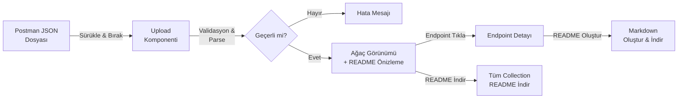
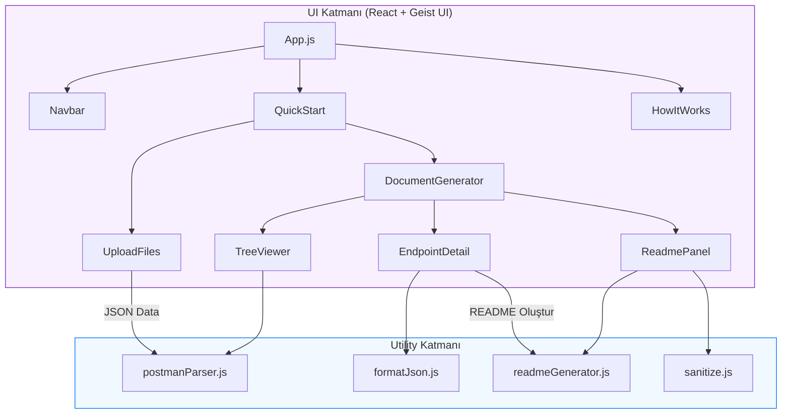
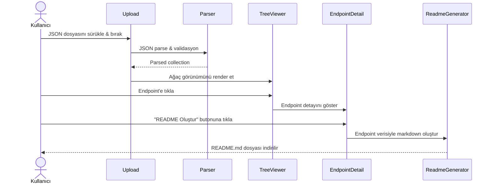
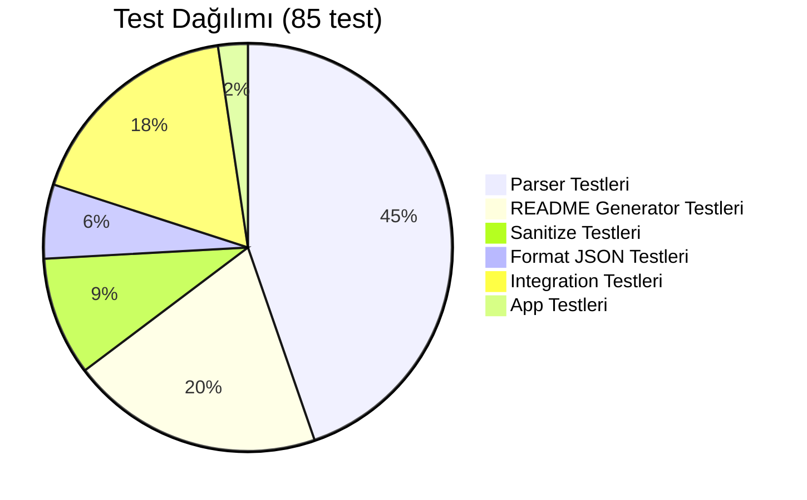

<div id="top"></div>

<br />
<div align="center">
  <a href="https://github.com/muratdemirci/docwiz">
    
  </a>

  <h3 align="center">DocWiz — Documentation Wizard</h3>

  <p align="center">
    Postman collection JSON dosyalarını import edin, endpoint'leri görüntüleyin ve tek tıkla README oluşturun.
    <br />
    <strong>Frontend-only</strong> — backend gerektirmez, tüm işlemler tarayıcıda yapılır.
  </p>
</div>

---

## İçindekiler

- [Hakkında](#hakkında)
- [Uygulama Akışı](#uygulama-akışı)
- [Mimari](#mimari)
- [Teknolojiler](#teknolojiler)
- [Kurulum](#kurulum)
- [Kullanım](#kullanım)
- [Proje Yapısı](#proje-yapısı)
- [Test](#test)
- [Yol Haritası](#yol-haritası)
- [Katkıda Bulunma](#katkıda-bulunma)
- [Lisans](#lisans)
- [İletişim](#iletişim)

---

## Hakkında


DocWiz, REST API'lerinizin **Postman v2.1 collection export** dosyalarını alıp:

- Endpoint'leri ağaç yapısında görüntüler
- Seçilen endpoint'in tüm detaylarını gösterir (method, URL, headers, query params, body, responses)
- Tek tıkla o endpoint için **Markdown README** oluşturur ve indirir
- Tüm collection için README önizleme ve indirme sunar

Hiçbir backend veya API çağrısı gerektirmez — **tamamen tarayıcıda** çalışır.

---

## Uygulama Akışı


```mermaid
flowchart LR
    A[Postman JSON\nDosyası] -->|Sürükle & Bırak| B[Upload\nKomponenti]
    B -->|Validasyon &\nParse| C{Geçerli mi?}
    C -->|Hayır| D[Hata Mesajı]
    C -->|Evet| E[Ağaç Görünümü\n+ README Önizleme]
    E -->|Endpoint Tıkla| F[Endpoint Detayı]
    F -->|README Oluştur| G[Markdown\nOluştur & İndir]
    E -->|README İndir| H[Tüm Collection\nREADME İndir]
```

---

## Mimari


```mermaid
graph TD
    subgraph UI["UI Katmanı (React + Geist UI)"]
        App[App.js]
        Nav[Navbar]
        QS[QuickStart]
        HW[HowItWorks]
        UF[UploadFiles]
        DG[DocumentGenerator]
        TV[TreeViewer]
        ED[EndpointDetail]
        RP[ReadmePanel]
    end

    subgraph Utils["Utility Katmanı"]
        PP[postmanParser.js]
        RG[readmeGenerator.js]
        FJ[formatJson.js]
        SN[sanitize.js]
    end

    App --> Nav
    App --> QS
    App --> HW
    QS --> UF
    QS --> DG
    UF -->|JSON Data| PP
    DG --> TV
    DG --> ED
    DG --> RP
    TV --> PP
    ED --> FJ
    ED -->|README Oluştur| RG
    RP --> RG
    RP --> SN

    style UI fill:#f9f0ff,stroke:#7928ca
    style Utils fill:#f0f9ff,stroke:#0070f3
```

### Temel Prensipler

| Prensip | Uygulama |
|---------|----------|
| **Single Responsibility** | Her utility tek iş yapar: `postmanParser` parse eder, `readmeGenerator` markdown üretir, `sanitize` XSS temizler |
| **DRY** | `formatJson`, `KeyValueTable`, `generateTable` gibi paylaşılan modüller tekrarı önler |
| **Güvenlik** | `DOMPurify` ile HTML sanitization — kullanıcı dosyasından gelen veri asla raw render edilmez |
| **Frontend-Only** | Sıfır backend bağımlılığı, tüm işlem tarayıcıda |

---

## Teknolojiler

| Teknoloji | Versiyon | Kullanım |
|-----------|----------|----------|
| [React](https://reactjs.org/) | 17.x | UI framework |
| [Geist UI](https://react.geist-ui.dev/) | 2.x | Component kütüphanesi |
| [React Router](https://reactrouter.com/) | 6.x | Client-side routing |
| [react-dropzone](https://react-dropzone.js.org/) | 11.x | Dosya sürükle & bırak |
| [DOMPurify](https://github.com/cure53/DOMPurify) | 3.x | XSS koruması |
| [Testing Library](https://testing-library.com/) | — | Test altyapısı |

---

## Kurulum

```bash
# Repoyu klonlayın
git clone https://github.com/muratdemirci/docwiz.git
cd docwiz

# Bağımlılıkları yükleyin
npm install

# Geliştirme sunucusunu başlatın
npm start
```

Uygulama varsayılan olarak `http://localhost:3000` adresinde açılır.

---

## Kullanım


```mermaid
sequenceDiagram
    actor K as Kullanıcı
    participant U as Upload
    participant P as Parser
    participant T as TreeViewer
    participant E as EndpointDetail
    participant R as ReadmeGenerator

    K->>U: JSON dosyasını sürükle & bırak
    U->>P: JSON parse & validasyon
    P-->>U: Parsed collection
    U->>T: Ağaç görünümünü render et
    K->>T: Endpoint'e tıkla
    T->>E: Endpoint detayını göster
    K->>E: "README Oluştur" butonuna tıkla
    E->>R: Endpoint verisiyle markdown oluştur
    R-->>K: README.md dosyası indirilir
```

1. **"Hızlı Başlangıç"** sekmesine gidin
2. Postman collection JSON dosyanızı **sürükleyip bırakın** veya tıklayıp seçin
3. Sol panelde **ağaç görünümünden** bir endpoint'e tıklayın
4. Sağ panelde endpoint detaylarını inceleyin
5. **"README Oluştur"** butonuna tıklayarak o endpoint'in README'sini indirin
6. Veya hiç endpoint seçmeden **"README İndir"** ile tüm collection README'sini indirin

> **İpucu:** Proje içinde örnek bir Postman collection dosyası bulunmaktadır: `src/test-data/sample-collection.json`

---

## Proje Yapısı

```
src/
├── components/
│   ├── Navbar/                  # Navigasyon (functional, route-based active state)
│   ├── Upload/                  # Dosya yükleme (dropzone + validasyon)
│   └── DocumentGenerator/
│       ├── TreeViewer/          # Postman collection ağaç görünümü
│       ├── EndpointDetail/      # Seçili endpoint detay paneli
│       └── ReadmePanel/         # README önizleme + indirme
├── contents/
│   ├── HowItWorks.js           # Bilgilendirme sayfası
│   ├── QuickStart.js           # Ana uygulama sayfası
│   └── NotFoundPage.js         # 404 sayfası
├── utils/
│   ├── postmanParser.js        # Postman v2.1 collection parser
│   ├── readmeGenerator.js      # Markdown README üretici
│   ├── formatJson.js           # JSON formatlama utility
│   └── sanitize.js             # DOMPurify HTML sanitization
└── test-data/
    └── sample-collection.json  # Test için örnek Postman collection
```

---

## Test

```bash
# Tüm testleri çalıştır
npm test

# Verbose çıktı ile
npx react-scripts test --watchAll=false --verbose
```


```mermaid
pie title Test Dağılımı (85 test)
    "Parser Testleri" : 38
    "README Generator Testleri" : 17
    "Sanitize Testleri" : 8
    "Format JSON Testleri" : 5
    "Integration Testleri" : 15
    "App Testleri" : 2
```

| Test Suite | Kapsam |
|------------|--------|
| `postmanParser.test.js` | Validasyon, parse, flatten, edge case'ler |
| `readmeGenerator.test.js` | Markdown üretimi, TOC, tablo, download |
| `sanitize.test.js` | XSS koruması, script/iframe/event handler temizleme |
| `formatJson.test.js` | JSON formatlama, geçersiz input handling |
| `integration.test.js` | Upload akışı, Navbar, DocumentGenerator, E2E flow |

---

## Yol Haritası

- [x] Postman v2.1 collection import & parse
- [x] Ağaç görünümünde endpoint listesi
- [x] Endpoint detay görüntüleme (method, URL, headers, body, responses)
- [x] Tek endpoint için README oluşturma & indirme
- [x] Tüm collection için README önizleme & indirme
- [x] DOMPurify ile XSS koruması
- [x] 85 test ile kapsamlı test coverage
- [ ] Birden fazla endpoint seçerek toplu README oluşturma
- [ ] README şablon özelleştirme
- [ ] Postman v2.0 collection desteği
- [ ] Dark mode

---

## Katkıda Bulunma

1. Projeyi fork edin
2. Feature branch oluşturun (`git checkout -b feature/yeni-ozellik`)
3. Değişikliklerinizi commit edin (`git commit -m 'feat: yeni özellik ekle'`)
4. Branch'inizi push edin (`git push origin feature/yeni-ozellik`)
5. Pull Request açın

---

## Lisans

Apache License 2.0 ile dağıtılmaktadır. Detaylar için `LICENSE` dosyasına bakın.

---

## İletişim

Murat Demirci — [@deusmur](https://twitter.com/deusmur) — deusmur@protonmail.com

Proje: [https://github.com/muratdemirci/docwiz](https://github.com/muratdemirci/docwiz)

<p align="right">(<a href="#top">yukarı dön</a>)</p>
